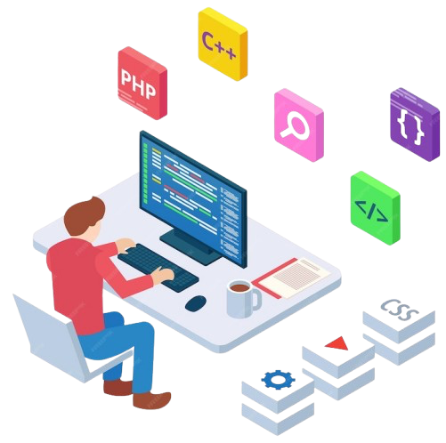

<h1 align="center">Hi 👋, I'm Vijwal Adla</h1>

  

  

<table>
  <tr>
    <td width="60%">
      <h1>Hi 👋, I'm Vijwal Adla</h1>
      

        
      

    </td>
    <td width="40%" align="right">
      
    </td>
  </tr>
</table>

---
## 🎓 Certifications & Professional Badges

  

  

  

  

  

  

  

## 👨‍💻 About Me

🎓 Final-year Computer Science student  
💡 Interested in **system design, backend logic & AI-driven products**  
🧩 I focus on **how things work**, not just making them work  
🚀 I enjoy turning ideas into **structured, scalable systems**

---

## 🛠 Tech Stack

  

---

## 🌟 Featured Project (Main)

### 🚀 InnovBridge — Innovation Meets Execution

  

**InnovBridge** is designed as a platform that connects ideas, technology, and execution
through a structured engineering approach.

**Highlights**
- Modular and scalable architecture  
- Clean frontend–backend separation  
- Built with real-world usability in mind  

**Tech:** React · Node.js · REST APIs · MongoDB  
🔗 https://github.com/AdlaVijwal/InnovBridge

---

## 🚦 Other Notable Projects

### 🚦 Smart Traffic Optimization System
- Real-time traffic density analysis  
- Adaptive signal control logic  
- Smart-city inspired system design  

**Tech:** Python · OpenCV · Machine Learning  
🔗 https://github.com/AdlaVijwal/Traffic_Optimization

---

### 🤖 Gemini Study Mentor
- AI-powered study assistance  
- Context-aware responses  
- Designed for exam preparation workflows  

**Tech:** Python · LLM · Prompt Engineering  
🔗 https://github.com/AdlaVijwal/Gemini-Study-Mentor

---

## 🎓 Certifications & Badges

  

  

  

  

  

  

  

---

## 🧠 How I Approach Engineering

✔ Think in systems, not scripts  
✔ Prefer clarity over cleverness  
✔ Document decisions and trade-offs  
✔ Build → test → refine  

---

## 📫 Connect With Me

- GitHub: https://github.com/AdlaVijwal  
- LinkedIn: *(add when ready)*  

  <i>“Good engineering is invisible — until it matters.”</i>

